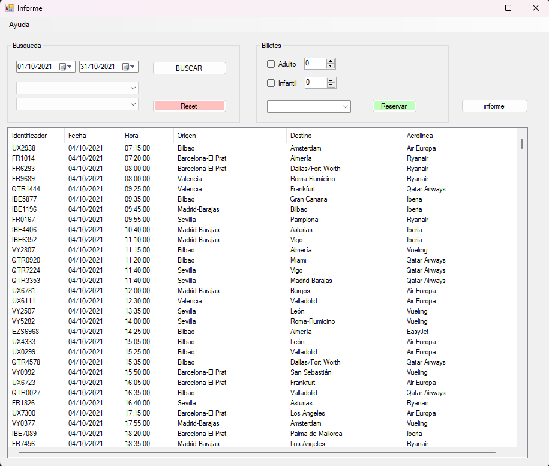

# DAM M07 - VisualStudio.NET & MySQL - Aplicación de demostración "Reserva de Vuelos"

## Descripcion

Aplicacion de reserva de vuelos desarrollada en VisualStudio.NET con conexi�n a base de datos MySQL.

## Requisitos

- VisualStudio.NET 2019 https://visualstudio.microsoft.com/es/vs/
- XAMMP 8.0.7 (Apache + MySQL + PHP + Perl) https://www.apachefriends.org/es/index.html
- MySQL Connector/NET 8.0.25 https://dev.mysql.com/downloads/connector/net/
- MySQL for Visual Studio 1.2.9 https://dev.mysql.com/downloads/windows/visualstudio/
- Script de creación de la base de datos "reservas.sql" (incluido en el repositorio) 

## Instalación

Para instalar la aplicacion, seguir los siguientes pasos:

1. Descargar el repositorio
2. Abrir el proyecto en VisualStudio.NET
3. Abrir el archivo "ReservaVuelos.sln"

## Configuración

Para instalar el conector ODBC, sigue estos pasos:

1. Descarga e instala el controlador ODBC para la base de datos que estás utilizando.
2. Abre el Panel de control y selecciona la opción "Herramientas administrativas".
3. Haz clic en "Orígenes de datos (ODBC)" para abrir el Administrador de orígenes de datos.
4. Selecciona la pestaña "Controladores" y haz clic en "Agregar".
5. Selecciona el archivo del controlador ODBC que descargaste anteriormente y haz clic en "Aceptar".
6. Ingresa el nombre del controlador y la información de conexión necesaria.
7. Haz clic en "Aceptar" para guardar la configuración.

El archivo de configuración de la base de datos se encuentra en el archivo "App.config" del proyecto.

## Capturas de pantalla

## Licencia
[MIT LICENSE](LICENSE.MD)
